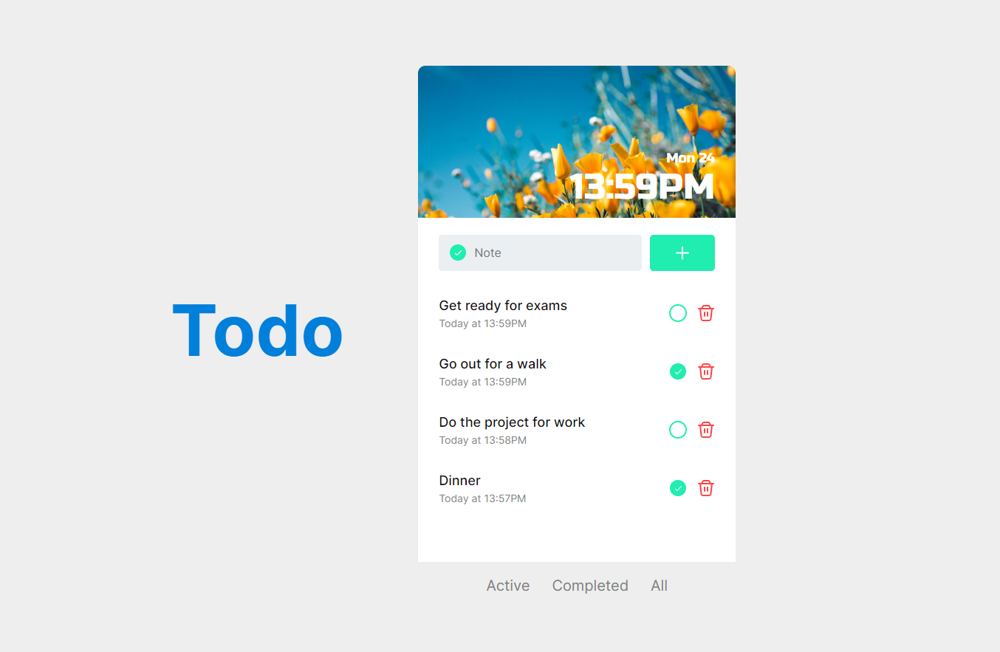
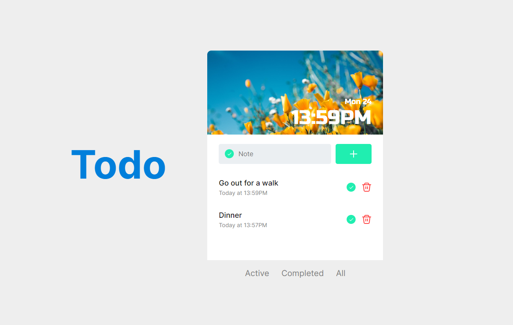

# Todo-App

## [Design(Figma)](<https://www.figma.com/file/SYvVOCG8qzk4FfKQThtc5e/Todo-UI-(Community)?node-id=0%3A1&mode=dev>)

## [Live URL](https://todo-react-app-xi-ten.vercel.app)

## Technologies Used

- Vite
- React
- TypeScript
- Styled Components
- date-fns
- react-helmet
- Vercel (for deployment)

## Getting Started

To get a local copy of the project up and running, follow these steps:

1.  Clone the repository:

    ```shell
    git clone https://github.com/TemuriTsutskiridze/Todo-React-App.git
    ```

2.  Install the dependencies:

    ```shell
    cd project-name
    npm install
    ```

## Design Preview




## React + TypeScript + Vite

This template provides a minimal setup to get React working in Vite with HMR and some ESLint rules.

Currently, two official plugins are available:

- [@vitejs/plugin-react](https://github.com/vitejs/vite-plugin-react/blob/main/packages/plugin-react/README.md) uses [Babel](https://babeljs.io/) for Fast Refresh
- [@vitejs/plugin-react-swc](https://github.com/vitejs/vite-plugin-react-swc) uses [SWC](https://swc.rs/) for Fast Refresh

### Expanding the ESLint configuration

If you are developing a production application, we recommend updating the configuration to enable type aware lint rules:

- Configure the top-level `parserOptions` property like this:

```js
   parserOptions: {
    ecmaVersion: 'latest',
    sourceType: 'module',
    project: ['./tsconfig.json', './tsconfig.node.json'],
    tsconfigRootDir: __dirname,
   },
```

- Replace `plugin:@typescript-eslint/recommended` to `plugin:@typescript-eslint/recommended-type-checked` or `plugin:@typescript-eslint/strict-type-checked`
- Optionally add `plugin:@typescript-eslint/stylistic-type-checked`
- Install [eslint-plugin-react](https://github.com/jsx-eslint/eslint-plugin-react) and add `plugin:react/recommended` & `plugin:react/jsx-runtime` to the `extends` list
